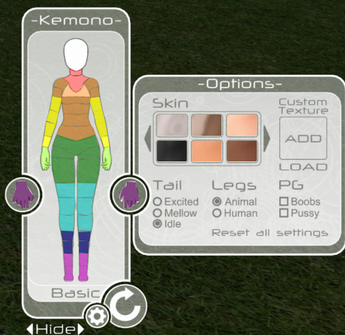

# Kemono Auto Masking
Notes on auto-masking for the Kemono

##  Neck Area (Red)

This basic region consists of the following advanced regions: 

1. neck
2. collar

## Body Area (Orange)

This basic region consists of the following advanced regions:

<table>
    <tr><th>Left</th><th>Center</th><th>Right</th></tr>
    <tr><td>shoulderUL</td><td>chest</td><td>shoulderUR</td></tr>
    <tr><td>shoulderLL</td><td>breast</td><td>shoulderLR</td></tr>
    <tr><td> </td><td>ribs</td><td> </td></tr>
    <tr><td> </td><td>abs</td><td> </td></tr>
    <tr><td> </td><td>belly</td><td> </td></tr>
</table>

## Arms (Yellow)

This basic region consists of the following advanced regions: 

<table>
    <tr><th>Left</th><th>Right</th></tr>
    <tr><td>armUL</td><td>armUR</td></tr>
    <tr><td>elbowL</td><td>elbowR</td></tr>
    <tr><td>armLL</td><td>armLR</td></tr>
    <tr><td>wristL</td><td>wristR</td></tr>
</table>

## Hands (Light Green)

This basic region consists of the following advanced regions: 

<table>
    <tr><th>Left</th><th>Right</th></tr>
    <tr><td>handL</td><td>handR</td></tr>
</table>

## Pelvis (Dark Green)

This basic region consists of the following advanced regions: 

<table>
    <tr><th>Left</th><th>Center</th><th>Right</th></tr>
    <tr><td> </td><td>pelvis</td><td> </td></tr>
    <tr><td>hipL</td><td> </td><td> hipR</td></tr>
    <tr><td>thighUL</td><td> </td><td>thighUR</td></tr>
</table>

## Legs (Light Blue)

This basic region consists of the following advanced regions: 

<table>
    <tr><th>Left</th><th>Right</th></tr>
    <tr><td>thighLL</td><td>thighLR</td></tr>
    <tr><td>kneeL</td><td>kneeR</td></tr>
    <tr><td>calfL</td><td>calfR</td></tr>
</table>

## Shins (Dark Blue)

This basic region consists of the following advanced regions: 

<table>
    <tr><th>Left</th><th>Right</th></tr>
    <tr><td>shinUL</td><td>shinUR</td></tr>
    <tr><td>shinLL</td><td>shinLL</td></tr>
</table>

## Feet (Light Purple)

This basic region consists of the following advanced regions: 

<table>
    <tr><th>Left</th><th>Right</th></tr>
    <tr><td>ankleL</td><td>ankleR</td></tr>
    <tr><td>footL</td><td>footR</td></tr>
</table>

## Hand Positions (Dark Purple)

This basic region consists of the following advanced regions: 

<table>
    <tr><th>Left</th><th>Right</th><th>Value</th><th>Description</th></tr>
    <tr><td>Lhand</td><td>Rhand</td><td>1</td><td>Open hand, fingers extended</td></tr>
    <tr><td>Lhand</td><td>Rhand</td><td>2</td><td>Closed hand, in a fist</td></tr>
    <tr><td>Lhand</td><td>Rhand</td><td>3</td><td>Open hand, fingers, relaxed</td></tr>
    <tr><td>Lhand</td><td>Rhand</td><td>4</td><td>Closed hand, index finger extended (pointing)</td></tr>
    <tr><td>Lhand</td><td>Rhand</td><td>5</td><td>Closed hand, index and pinkie fingers extended (sign of the horns; rock on)</td></tr>
</table>

## Tail Activity

<table>
    <tr><th>Key</th><th>Value</th><th>Description</th></tr>
    <tr><td>tail</td><td>1</td><td>Excited</td></tr>
    <tr><td>tail</td><td>2</td><td>Mellow</td></tr>
    <tr><td>tail</td><td>3</td><td>Idle</td></tr>
</table>

## Leg Type

<table>
    <tr><th>Command</th><th>Description</th></tr>
    <tr><td>Flegs</td><td>animal legs</td></tr>
    <tr><td>Hlegs</td><td>human legs</td></tr>
</table>

## PG Mode

<table>
    <tr><th>Key</th><th>Description</th></tr>
    <tr><td>show:nips</td><td>Boobs unchecked (nipples visible)</td></tr>
    <tr><td>hide:nips</td><td>Boobs checked (nipples not shown)</td></tr>
    <tr><td>show:vagoo</td><td>Pussy unchecked (vulva visible)</td></tr>
    <tr><td>hide:vagoo</td><td>Pussy checked (vulva not shown)</td></tr>
</table>

